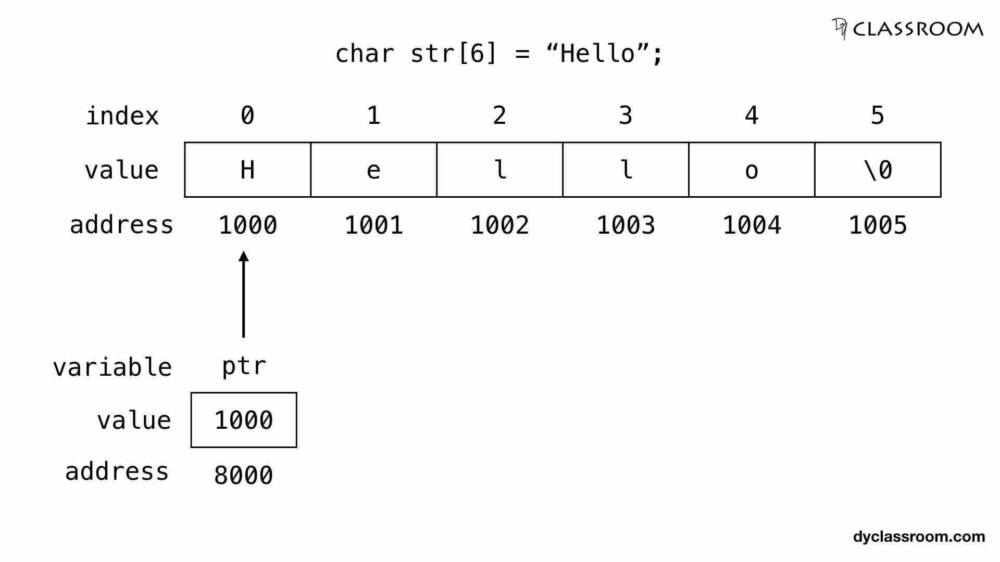
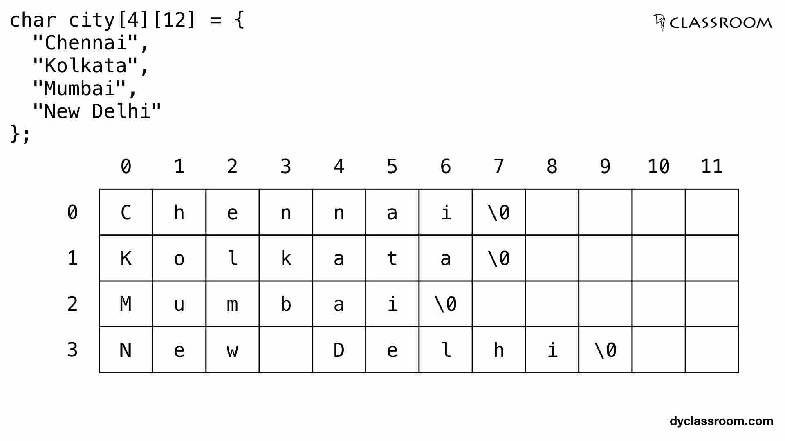
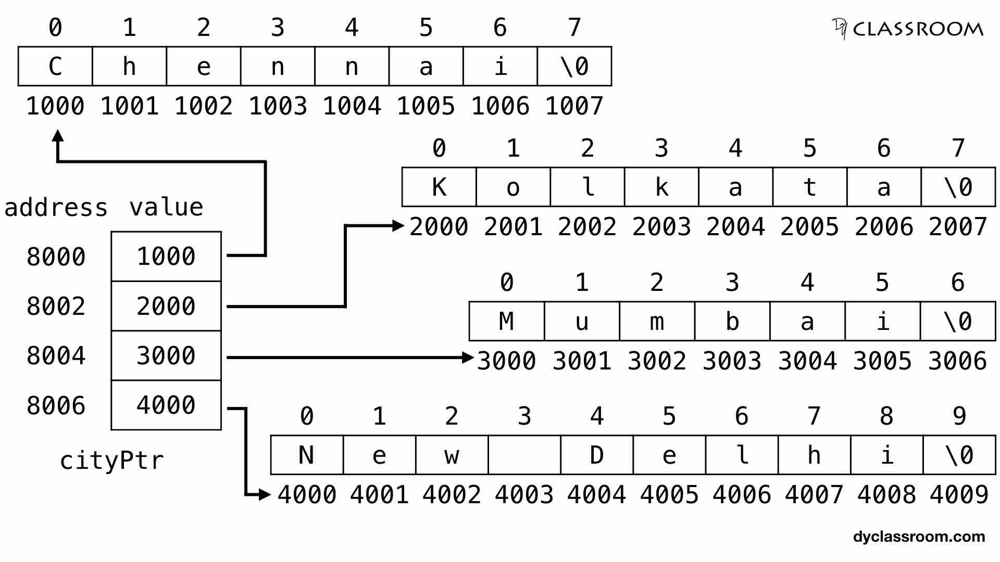

# 指针概览

你可能已经听说过，C 语言是贴近底层的编程语言。这是因为，C 语言未对计算机硬件作过多抽象，它方便而又灵活的语言特性为与硬件交互提供了极大便利。

指针是 C 语言的核心特性之一，它的灵活性与强大性，使得 C 语言成为与硬件交互的首选语言。但是，指针也是 C 语言中最容易引发错误的特性之一，它要求使用者正确理解内存模型，并对指针的使用严加约束。

本文将尽量全面地讲解指针的定义与特性，并梳理部分使用技巧。在此之前，为了准确理解指针，我们需要先了解 C 语言的内存模型与对象模型。

<!-- prettier-ignore-start -->
!!! tip "阅读提示"

    程算课程中学习的 C 语言语法均在 C99 标准规定的范围内。下文中，如果未作额外说明，所有内容均基于 C99 标准。

    下文中部分提示默认被折叠。此类提示为拓展内容，对知识积累与理解能力有一定要求，但有助于理解一些细节问题，请酌情阅读。
<!-- prettier-ignore-end -->

## 底层概念

### 内存模型

<!-- prettier-ignore-start -->
!!! note inline end "内存模型"

    

    存储在内存中的一个字符串，其每个字节的索引、值与内存地址。
    
    （单击图片可放大）
<!-- prettier-ignore-end -->

在 C 语言的内存模型中，**字节（Byte）**定义为一系列连续的**位（bit）**，是内存的最小可寻址单元。在几乎所有现代计算机上，一个字节的长度都是 8 位，我们的讨论也基于这一标准。

所谓“可寻址”指的是内存中的所有字节都拥有一个唯一编号，也即**内存地址**。习惯上，内存地址由长度一定的、从 0 开始递增的无符号整数表示，其长度由操作系统决定。

<!-- prettier-ignore-start -->
??? info "常见架构中内存地址的长度"

    我们经常接触的处理器架构中，x86（又称 IA-32）架构使用 32 位长的内存地址，x86-64（又称 x64、AMD64、Intel 64）与 ARM64（又称 AArch64）架构使用 64 位长的内存地址。容易看出，x86 架构支持的最大内存空间只有 4 GB，而后两个架构支持的最大内存空间则远超前者。
<!-- prettier-ignore-end -->

### 对象

C 语言将程序使用的数据抽象为**对象**，它被定义为执行环境中内存的一个区域，其内容可以表示*特定类型的值*。根据数据类型与长度的不同，一个对象可占据一个或多个字节，我们称起始字节的内存地址为*该对象的内存地址*。

每个对象可以用 `memcpy` 复制到 `unsigned char[n]` 类型的对象中，我们称生成的数组内容为*对象表示*。方便起见，我们通常以十六进制整数序列形式展示对象表示，每两位十六进制数代表一个字节。举例来说，`int` 类型常量 `1` 在小端序计算机上的对象表示为 `0x01 00 00 00`。

另外，对象表示和值并不要求一一对应，两个值相等的对象可以拥有不同的对象表示。

除了直接使用**字面量**（常量的一种）创建对象外，还可以通过声明语句创建，并为其分配一个**标识符**，以掩盖分配内存空间与访问内存地址的细节过程，并增强程序可读性。

<!-- prettier-ignore-start -->
??? info "标识符"

    C 标准定义，标识符是数字、下划线、小写及大写拉丁字母的任意长度序列（不讨论 Unicode 字符）。合法的标识符必须以非数字字符开始，以区别于整数常量或浮点常量。

    > 标识符能指代下列类型的实体：
    >
    > - 对象
    > - 函数
    > - 标签（struct、union 或枚举）
    > - 结构体或联合体成员
    > - 枚举常量
    > - typedef 名
    > - 标号名
    > - 宏名
    > - 宏形参名
    >
    > 宏名或宏形参名以外的每个标识符都拥有作用域，并可以拥有链接。相同的标识符可以在程序的相异点指代相异实体。

    **关键字也属于标识符**，但它们被保留，不可在程序中声明。以一个或多个下划线开始的标识符也不应在程序中出现；根据约定，这些标识符应由库的内部实现使用。另外，还有一些标识符被指定保留，此处不再展开。
<!-- prettier-ignore-end -->

<!-- prettier-ignore-start -->
!!! warning "区分对象概念"

    如果你学习过或将要学习其他编程语言，请严格区分不同语言中的对象概念，尤其是面向对象语言中的“对象”。
<!-- prettier-ignore-end -->

因此，声明一个变量实际上包括两步：首先，为对象申请一块对应大小的内存空间；其次，将标识符与对象相关联。

当程序尝试读取或修改对象的内容时，我们称程序*访问*了该对象或该内存地址。

## 基本语法

### 指针类型

一般而言，提到“指针”时，我们实际讨论的是**指针类型**对象。

C 标准对指针类型的定义如下：

> A pointer type may be derived from a function type, an object type, or an incomplete type, called the referenced type. A pointer type describes an object whose value provides a reference to an entity of the referenced type. A pointer type derived from the referenced type $T$ is sometimes called "pointer to $T$".

C 语言中，指针类型与其他类型拥有相同的对象模型，指针类型的对象同样需要申请内存空间以存储值。不同之处在于，指针类型对象的值为“另一个对象的引用”，也即其内存地址。我们称指针类型的对象*指向*被引用对象。

指针类型是一种**派生类型**，这意味着完整的指针类型包括*被引用对象的类型*。由于在内存中所有数据均以一系列连续位的形式存储，为正确读取数据，这种额外的记录显然是必要的。

相对应地，不同指针类型间是否兼容，取决于被引用对象的类型是否兼容。

### 声明

指针类型对象的声明语法如下：

```c
type-specifier * qualifiers declarator
```

其中，`type-specifier` 为*被引用对象的类型*，`qualifiers` 为*对指针类型对象的限定*，`declarator`为*指针类型对象的标识符*（名称）。

<!-- prettier-ignore-begin -->
??? info "正确添加限定与存储类型说明"

    需要注意的是，只有出现在 `*` 与标识符之间的限定才会被赋予指针类型。举例来说，语句 `char * const p;` 声明了一个类型为 `char *` 的、值不可变的指针 `p`，它指向的对象类型为 `char`，值可通过指针 `p` 改变；而语句 `const char * p;` 声明了一个类型为 `const char *` 的、值可变的指针 `p`，它指向的对象类型为 `const char`，值不可通过指针 `p` 改变。

    另外，存储类型说明符并没有类似的语义，它必须置于 `*` 之前。从语法上说，它们属于*说明符*而非*限定符*，不应置于 `*` 与标识符之间；从语义上来说，记录被引用对象类型的目的是从目标内存地址正确读取数据，而了解指向对象的存储类型对这一目的毫无帮助。
<!-- prettier-ignore-end -->

需要注意的是，声明中 `*` 只对直接结合的标识符生效。举例来说，如果通过语句 `int * a, b;` 声明变量 `a` 与 `b`，那么只有 `a` 会被认定为指针类型。

在声明指向某些类型对象的指针时，可通过括号使 `*` 优先与标识符结合，以避免运算符优先级差异导致的歧义。举例来说，语句 `int *arr[3];` 声明了一个**元素类型为 `int *`** 且长度为 3 的数组 `arr`；语句 `int (*ptr)[3];` 则声明了一个指针 `ptr`，它指向一个**元素类型为 `int`** 且长度为 3 的数组。

此外，被引用对象的类型可以是不完整类型。举例来说，语句 `int (*p)[];` 表明指针 `p` 指向一个元素类型为 `int`，且**长度未知**的数组。这意味着我们不关心数组长度，或者数组长度需要在之后的程序中通过某些方法确定。相对应地，无法对解引用 `p` 的结果使用 `sizeof` 运算符。

<!-- prettier-ignore-start -->
??? info "通用指针类型 `void *`"

    由于 `void` 也属于不完整类型，`void *` 同样是合法的指针类型。它的实际含义是指针指向一个**类型未知**的对象，也即指针可以指向任何类型的对象。自然地，我们无法解引用该类型的指针对象。不过，它可被隐式转换为任意其他类型的指针，反之亦然。
    
    虽然 C 语言在 C11 标准前并未提供泛型特性，但通过引入 `void *` 类型参数，我们仍然可以设计通用接口，使用相同代码处理不同类型的数据。一个典型的例子是，`stdlib.h` 中定义的 `qsort` 与 `bsearch` 方法都通过将数组指针 `ptr` 的类型规定为 `void *`，实现了无视数组元素类型重用排序代码的效果。
    
    当然，因为被引用对象的类型未知，此时 C 语言编译器无法帮你检查类型兼容问题，所以使用 `void *` 类型指针时需万分小心。
<!-- prettier-ignore-end -->

### 值与运算

通过指针获得被引用对象的过程称为**解引用**，由运算符 `*` 完成；通过某个对象获得指向该对象指针的过程称为**取址**，由运算符 `&` 完成。

结合赋值操作，可根据需要通过指针访问并修改指向的对象，或令指针指向不同的对象。举例来说，对于 `int` 类型变量 `a`，语句 `p = &a;` 将使指针 `p` 的值设为 `a` 的内存地址，也即令 `p` 指向 `a`；在此基础上，语句 `*p = 1;` 将改变 p 指向的对象，也即变量 `a` 的值。

不过，在编写表达式时，需要注意运算符优先级的影响。举例来说，表达式 `*p++` 将使指针 `p` 的值自增 1，而表达式 `(*p)++` 将使指针 `p` 指向对象的值自增 1。

<!-- prettier-ignore-start -->
!!! note "理解初始化语句中的 `*` 运算符"

    > C 语言的语法力图使声明和使用相一致。

    在阅读指针初始化语句时，你可能常常混淆 `*` 的声明与解引用语法。正确分辨的要点在于，初始化语句分为声明和初始化器两部分，其中赋值号 `=` 前的部分为声明，赋值号及其后的部分为初始化器。
    
    举例来说，在语句 `int *ip = *ipp;` 中，`int *ip` 为声明，`= *ipp` 为初始化器，这条语句的含义是：声明一个指向 `int` 类型对象的指针 `ip`，并将它的初始值设为 `ipp` 指向对象的值。

!!! warning "野指针"

    声明自动作用域的对象后，C 语言仅保证可以正常访问并修改该对象，而不保证其初始内容，这点对指针同样成立。如果声明了一个指针却没有赋值，这个指针的指向便无法确定，我们称它为**野指针**。
    
    因为野指针可能指向任意内存段，不加鉴别的随意使用可能导致访问非法内存、损坏正常数据，甚至造成其他未知后果。**尝试解引用野指针是段错误（Segmentation Fault）的主要诱因之一。**因此，声明指针时务必完成初始化。
<!-- prettier-ignore-end -->

每种类型的指针都含有一个该类型的特殊值，称为**空指针值**。值为空的指针不指向任何对象，且解引用空指针是未定义行为。可使用空指针符号常量 `NULL` 为指针赋空值，它在 `stdio.h`、`stdlib.h`、`string.h`、`stddef.h` 等常用库中均有定义。根据 C 语言标准，`NULL` 的值为 0。

<!-- prettier-ignore-start -->
??? info "空指针常量 `NULL` 的值"

    根据 C 标准定义，宏 `NULL` 是实现定义的空指针常量，它可以是值为 0 的整数常量表达式，或者被转换为 `void *` 类型的此类表达式。

    那么，为什么 `NULL` 的值被规定为 0 呢？
    
    你可能会猜想，这是因为内存地址 0x0 被系统预留。对早期操作系统而言，这种说法是成立的；但是现在，不同平台对空指针的值已经有许多不同的规定。无论 `NULL` 的值被如何定义，链接器都应将空指针的值改为目标平台指定的空指针值。为了强调这一点，C++11 引入了 `nullptr` 关键字，但 C 标准并未对此作任何修改。
    
    回到问题本身，将 0 视作特殊值的习惯是一个比较有说服力的理由。此外，将 `NULL` 定义为 0 也可以简化表达式，即利用 C 语言将 0 视为 false 的特性，简化对指针是否为空的判断。
<!-- prettier-ignore-end -->

两个类型兼容的指针间的赋值运算、比较运算与减法运算是有效的。若指针类型不兼容，则需要进行强制类型转换。这种运算仅在少数情形下有意义，如两个指针位于同一数组内时。

指针与整数间的加法或减法运算也是有效的，其含义是令指针前移或后移若干个指向对象的长度。举例来说，表达式 `p + n` 的值，代表指针 `p` 当前指向的对象之后第 n 个对象的地址。这种运算在数组与字符串操作中十分常见。

虽然内存地址往往是一个非负整数，但是指针与整数之间不能相互转换，0 是唯一的例外：常量 0 可以赋值给指针，指针也可与常量 0 进行比较。显然，此时常量 0 将被视为空指针 `NULL`。

除以上运算外，其他形式的指针运算都是非法的。

## 用法概述

### 参数传递

在 C 语言中，调用函数时以**值传递**形式传递参数；具体而言，每次调用函数时会重新创建形参，并将实参的值复制到对应的形参。函数可以修改自身形参，但是实参的值不会随之改变。这种设计将函数与数据隔离，避免产生意料之外的副作用。

<!-- prettier-ignore-start -->
??? info "C 语言中只有值传递"

    如果你学习过 C++，你可能会想到在形参类型中添加 `&` 运算符，以将其声明为实参的引用。然而，C 语言中并没有引用语法，`&` 运算符在 C 语言中仅用于取址。
<!-- prettier-ignore-end -->

不过，如果我们期望函数产生副作用，值传递的方式便无法满足需求。为解决这一问题，我们可以引入指针类型的参数，以达到修改其他对象的目的。

<!-- prettier-ignore-start -->
???+ example "案例：交换函数"

    假设 `fake_swap` 函数定义如下：

    ```c
    void fake_swap(int x, int y) {
        int tmp = x;
        x = y;
        y = tmp;
    }
    ```

    调用部分如下：

    ```c
    int a = 1, b = 2;
    fake_swap(a, b);
    ```

    在调用 `fake_swap` 函数后检查 `a`、`b` 的值，可发现它们的值并没有交换。这是因为，调用 `fake_swap` 函数时，实参 `a`、`b` 的值被复制给形参 `x`、`y`，函数仅修改了形参的值，并未影响函数外部的实参。

    现在，我们将 `fake_swap` 函数修改为：

    ```c
    void swap(int *x, int *y) {
        int tmp = *x;
        *x = *y;
        *y = tmp;
    }
    ```

    调用部分如下：

    ```c
    int a = 1, b = 2;
    swap(&a, &b);
    ```

    在调用 `swap` 函数后检查 `a`、`b` 的值，可发现它们的值已经交换。这是因为，调用 `swap` 函数时，实参 `a`、`b` 的地址被复制给形参 `x`、`y`，也就是说，`x`、`y` 分别指向 `a`、`b`。函数修改了 `x`、`y` 指向对象的值，也就是 `a`、`b` 的值，因此虽然 `a`、`b` 在函数外部，但它们的值已被成功修改。
<!-- prettier-ignore-end -->

C 语言中的函数只有一个返回值。若要返回多个值，可将所有返回值放入结构体中；但是，这需要额外声明一个临时使用的结构体类型，拆解结构体的过程也耗时耗力。一个更好的方案是，向函数传递指针参数，由函数通过指针将结果写入目标对象。我们经常使用的 `scanf` 函数便是一个典型例子。

### 操作数组

一般而言，提到“数组”时，我们讨论的既可以是**数组类型**，也可以是**数组类型的对象**。

指针与数组的关系十分密切，它们之间的转换也是 C 语言中最常见的类型转换之一。一般来说，用指针编写的程序比用数组编写的程序执行速度快，但可读性相对较差。

<!-- prettier-ignore-start -->
!!! tip "阅读建议"
    
    下文的讨论中会讲解数组的部分特性，不过仍然建议在熟悉数组后阅读。
<!-- prettier-ignore-end -->

#### 数组退化

数组的值就是该数组第一个元素的地址；实际使用中，数组也经常可被看作指向其首元素指针。事实上，C 标准对此作如下规定：

> 任何数组类型的左值表达式，当用于**异于**
>
> -   作为取地址运算符的操作数
> -   作为 sizeof 的操作数
> -   作为用于数组初始化的字符串字面量
>
> 的语境时，会经历到指向其*首元素*的指针的隐式转换。

习惯上，我们将数组到指针的隐式转换过程，称为数组*退化*为指针。

C 标准规定，表达式 `E1[E2]` 等价于 `(*((E1) + (E2)))`。这意味着，数组元素在内存中连续。另外，如果确信相应元素存在，可以通过指定超出数组范围的下标，访问数组前后的元素。

<!-- prettier-ignore-start -->
!!! warning "数组访问越界"

    C 语言不会检查数组下标是否超过数组长度，对指针也几乎没有限制措施。尝试访问超出数组边界的内存地址，可能导致与尝试解引用野指针等同的危害。**数组访问越界是段错误的主要诱因之一。**因此，访问数组元素前，务必充分检查指定的下标与指针偏移量是否在数组范围内。
<!-- prettier-ignore-end -->

根据标准规定，作为参数传递时，数组应被隐式转换为其首元素指针，这是因为复制数组的开销经常大到不可接受。所以，在语法层面上，函数定义中（即参数类型与返回值类型处）`char []` 类型声明与 `char *` 类型声明是等价的，不过前者可以提醒函数编写者与使用者留意 `s` 的实际含义。当然，你也可以传入指向其他元素的指针，这对函数而言没有语义区别。

<!-- prettier-ignore-start -->
!!! note "数组类型与指针类型的区别"

    尽管在程序中数组经常退化为指针，我们仍应该区分这两个类型。举例来说，考虑如下的程序片段（C 标准规定 `sizeof` 的返回值类型为 `size_t`，应使用 `%zd` 格式指示符输出）：

    ```c
    long a[3], *p;
    printf("%zd %zd", sizeof(a), sizeof(p));
    ```

    它将会输出 `12 8`。这是因为，`a` 是一个元素类型为 `long` 且长度为 3 的数组对象，在多数系统中 `long` 类型长度为 4 字节，因此 `a` 的长度为 12 字节；而 `p` 是一个指针，在常用的 64 位系统中长度为 8 字节。

    另外，指针的值可在任意时刻通过赋值修改，而数组不能被赋值。
<!-- prettier-ignore-end -->

#### 多维数组

与指针类似，数组也是派生类型。不同之处在于，为了正确访问数组元素，需要知道数组元素的长度，即数组元素的类型必须是完整的。

<!-- prettier-ignore-start -->
!!! note inline end "多维数组"

    
<!-- prettier-ignore-end -->

我们称元素类型为数组的数组为**多维数组**。需要注意的是，`[]` 运算符是从右往左结合的。举例来说，语句 `int a[2][3];` 声明了一个**长度为 2 **的数组 `a`，它的元素类型为 `int [3]`；对应地，通过表达式 `a[x][y]` 访问数组元素时，`x` 与 `y` 的取值范围分别为 0~1 与 0~2。

当应用数组到指针转换时，多维数组被转换成指向其首元素的指针。我们称这种指向数组的指针为**数组指针**。举例来说，`int [2][3]` 类型的二维数组会被转换为 `int (*)[3]` 类型的数组指针。

<!-- prettier-ignore-start -->
???+ example "案例：通过指针访问多维数组元素"

    根据 C 标准规定，不难推断出表达式 `a[i][j]` 与表达式 `*(*(a + i) + j)` 等价。不过，后者的求值过程相比前者更加抽象。下面，我们将以此为例逐步分析其求值过程。

    1. 假设 `a` 的类型为 `int [2][3]`。我们知道，此处数组 `a` 会被隐式转换为 `int (*)[3]` 类型的指针。回忆一下指针与整数的加减法运算，`p + i` 并非简单地将指针 `p` 的值增加 `i` 字节，而是增加 `i` 个 `int [3]` 类型对象的长度，即 `i * sizeof(int [3])` 字节。

    2. 不妨称数组 `a` 隐式转换的指针为 `ap`。那么，内层表达式可改写为 `*(ap + i)`，其含义是从 `a` 开始，向后移动 `i * sizeof(int [3])` 个字节，并获得该内存地址存储的 `int [3]` 类型的数组。此时，我们得到了数组 `a[i]`。

    3. 不妨称上一步得到的数组为 `a_i`。那么，下一层表达式可以改写为 `*(a_i + j)`，其含义是从 `a_i` 开始，向后移动 `j * sizeof(int)` 个字节，并获得该内存地址存储的 `int` 类型对象的值。不难看出，我们得到的结果正是 `a[i][j]` 的值。

    有必要说明，以上分析过程对所有整数 `i`、`j` 均成立。这意味着，你可以使用表达式 `a[1][-1]` 访问 `a[0]` 中的最后一个元素。然而，此类表达式可读性不强，最好在实际程序中避免。
<!-- prettier-ignore-end -->

<!-- prettier-ignore-start -->
!!! note inline end "指针数组"

    
<!-- prettier-ignore-end -->


我们称元素类型为指针的数组为**指针数组**。容易想到，指针数组其实是个一维数组；不过由于其元素类型为指针，访问元素的形式与多维数组有部分相似之处。指针数组的一个典型用法是存储并传递命令行参数，即一种 `main` 函数声明 `int main(int argc, char *argv[])` 中的 `argv` 参数。

类似地，我们称指向某个指针的指针为**多级指针**。二级指针常见于链表操作中，更高级的指针则很少出现。

<!-- prettier-ignore-start -->
!!! note "数组退化的限度"

    回忆上文引用的 C 标准规定，若语境满足条件，数组将会隐式转换为指向其首元素的指针。这意味着，数组退化的限度是将指针级数增加一级。我们可以想到，这一限度是为了确保运算符 `[]` 的正确性，即保证按标准与其等价的指针运算可以正确计算偏移量。因此，**二维数组不能隐式转换为二级指针**。编译器对此将会给出警告。
<!-- prettier-ignore-end -->

#### 字符串

我们知道，C 语言中的字符串实际上是一个空字符（称为**中止字符**）结尾的字符数组。因此，上一小节的讨论同样适用于这一小节。

由于字符串同时具有数组的属性，讨论与内存空间有关的概念与操作时，为避免混淆，我们将数组对象占用的字节数称为其*大小*，将实际组成字符串的字符数称为其*长度*。一个直观理解是，字符串的大小计入中止字符，而其长度不计入。

在 C 语言中，我们可以使用**字符串字面量**表示一个字符串。字符串字面量是由一对 `"` 包围的任意长度的字符序列，其中的字符可以是一般字符或转义字符，如 `"abc"`、`"x y\nz"`、`""`。字符串字面量的末尾隐式包含中止字符。举例来说，`""` 代表大小为 1 的字符数组，它的唯一元素为 `'\0'`。

<!-- prettier-ignore-start -->
???- info "含空字符的字符串字面量"

    若字符串字面量的字符序列内包含空字符，则它表示含有多于一条字符串的数组。举例来说，对于字符串字面量 `"abc\0"`，它包含 `"abc"` 和 `""` 两个字符串。

    你可以通过 `sizeof` 运算符和 `strlen` 函数验证程序行为。
<!-- prettier-ignore-end -->

字符串字面量的类型为 `char [N]`，其中 `N` 是字符串的大小，包括隐式的中止字符。显然，字符串字面量也遵守数组到指针的隐式转换规则。

<!-- prettier-ignore-start -->
!!! warning "尝试修改字符串字面量"

    虽然字符串字面量的类型没有指定为 `const`，但它实际上也是常量。**尝试修改字符串字面量是未定义行为。**一般而言，字符串字面量的内容会被放入只读内存中，因此尝试修改会导致程序错误。
<!-- prettier-ignore-end -->

<!-- prettier-ignore-start -->
???+ example "字符串字面量的未退化情形"

    考虑如下程序片段：

    ```c
    char *str = "abc";
    printf("%zu %zu\n", sizeof("abc"), sizeof(str));
    ```

    它将会输出 `4 8`。这是因为，此时字符串字面量 `"abc"` 被作为 `sizeof` 的操作数，不会退化为指针，因此表达式 `sizeof("abc")` 的结果是字符串数组的大小。
<!-- prettier-ignore-end -->

不难想到，我们可以使用字符串字面量初始化数组，其效果相当于使用对应的字符数组常量初始化。与一般的数组初始化类似，数组长度可由初始化器隐式指定。举例来说，语句 `char str[] = "abc";` 等价于语句 `char str[] = {'a', 'b', 'c', '\0'};`，它声明并初始化了一个长度为 4 的字符数组 `str`。

数组的大小可以比字符串字面量的大小少 1，此时**中止字符将被忽略**。举例来说，语句 `char str[3] = "abc";` 等价于语句 `char str[3] = {'a', 'b', 'c'};`。

<!-- prettier-ignore-start -->
???+ example "案例：错误的字符数组初始化"

    考虑如下程序片段：

    ```c
    char str[3] = "abc";
    char backdoor[] = "xyz";
    printf("%s", str);
    ```

    它将会输出 `abcxyz`。这是因为，字符串字面量 `"abc"` 的大小 `str` 的大小大 1，初始化时中止字符被忽略，`str` 最终被初始化为 `{'a', 'b', 'c'}`。将其视为字符串并输出时，由于 `str` 内不含中止字符，输出函数将会继续访问 `str` 后的内存地址，即出现数组访问越界问题。

    由于 C 标准并未对字面量的内存排布作任何规定，在不同环境下字符串常量 `backdoor` 的内存地址可能位于 `str` 的内存地址之前。你可以尝试改变声明顺序以达到类似的输出效果。
<!-- prettier-ignore-end -->

根据隐式转换规则，在多数表达式中，字符串字面量将会隐式转换为指向它的指针。也就是说，该指针的值是字符串字面量的内存地址。类似地，被用于对指针的初始化时，字符串字面量也会退化为指针。

在函数内修改字符串时，传入的字符数组将会退化为指针，数组的大小信息因此丢失。可以想到，字符串末尾的空字符正是为这种情形设计的。

<!-- prettier-ignore-start -->
!!! tip "简化字符串操作函数"
    
    关于利用指针编写字符串操作函数的技巧，你可以参考《C 程序设计语言》（也就是程设课程使用的课本）中给出的 `strcpy` 与 `strcmp` 函数的实现迭代。本文对此不再赘述。
<!-- prettier-ignore-end -->

C 语言标准库中提供了一系列字符串操作函数，它们大多被定义在 `string.h` 头文件中，使用时均需保证提供的字符串格式符合约定。

<!-- prettier-ignore-start -->
!!! warning "中止字符缺失"

    标准库中的字符串操作函数通过检查中止字符判断是否到达字符串末尾。因此，在修改字符串时务必注意保留中止字符。**如果中止字符缺失，使用这些函数将会导致数组访问越界问题。**
<!-- prettier-ignore-end -->

### 函数指针

有时，我们希望函数可以遵循指定的规则，或者完成指定操作，但是又不希望或无法实现一系列高度相似的函数，因此我们希望在参数中引入另一个函数。C 语言为此提供了指向函数的指针，称为**函数指针**。

在编译得到的可执行文件中，程序中的指令与数据被分别存储，以供 CPU 访问并使用。函数指针的值，实际上是函数第一条指令的地址，也即函数的入口地址。

<!-- prettier-ignore-start -->
??? info "函数的内存布局"
    
    在可执行文件中，指令与数据被分别存储在代码段与数据段中。每个函数的指令往往被存储在代码段中的一段连续内存空间中，根据这一特点，我们可以将函数看作一种特殊的对象。
<!-- prettier-ignore-end -->

与数组类似，函数也会退化为指针。C 标准对此作如下规定：

> 任何函数指代器表达式，在用于**异于下列语境**时
>
> -   作为取址运算符的操作数
> -   作为 `sizeof` 的操作数
>
> 会经历到指向*表达式所指代函数*的指针的转换。

利用这个规则，我们可以使用函数名为函数指针赋值，也可以写出复杂的表达式。需要注意的是，`()` 运算符也是从右往左结合的，且优先级高于 `*` 运算符。举例而言，语句 `int *f(void);` 声明了一个函数 `f`，它的返回值类型为 `int *`；而语句 `int (*fp)(void);` 声明了一个函数指针 `fp`，它指向一个返回值类型为 `int` 的函数。

<!-- prettier-ignore-start -->
!!! tip "函数指针语句阅读练习"
    
    [另一篇笔记](funcptr.md)细致讲解了如何阅读并理解包含函数指针的语句，本文对此不再赘述。
<!-- prettier-ignore-end -->

### 结构体与内存管理

<!-- prettier-ignore-start -->
!!! tip "阅读建议"
    
    下文的讨论中会讲解结构体的部分特性，不过仍然建议在熟悉结构体后阅读。
<!-- prettier-ignore-end -->

结构体是一种**聚合类型**，它将多个不同类型的对象组合成一个对象。结构体经常被用于给一个复杂概念建立模型。

在复杂数据结构中，线性的数组往往无法展示数据间的逻辑关系，因此，我们往往会大量使用结构体与结构体指针。由于通过结构体指针访问其成员的情形十分常见，C 语言提供了 `->` 运算符以简化表达式。举例来说，表达式 `p->x` 等价于 `(*p).x`。

由于建立过程比较繁琐，我们希望一直存储完成建立的数据结构，以供程序中的其他部分使用；另一方面，它们往往会占用比较多的内存空间，因此我们也希望在需要时立刻销毁。对于这些需求，无论是全局变量还是静态局部变量都仍然不够灵活。为此，C 语言在 `stdlib.h` 中提供了**动态内存管理**函数。

常用的动态内存管理函数包括 `malloc` 与 `free`，它们分别负责申请与释放内存空间。

<!-- prettier-ignore-start -->
!!! warning "内存泄露"

    通过动态内存管理接口申请的内存空间将会一直被占用，直到程序结束或手动释放。如果你没有及时释放它们，未释放内存将无法被再分配。堆积的未释放内存最终可能导致程序占用的内存空间超过系统限额，我们称为**内存泄露**，此时程序将会被系统强制终止。因此，务必在不再使用动态内存时及时释放。
<!-- prettier-ignore-end -->

<!-- prettier-ignore-start -->
!!! warning "悬垂指针"

    释放申请得到的内存空间后，指向该内存空间的指针将会变成**悬垂指针**。尝试继续使用悬垂指针是未定义行为，**可能会导致程序崩溃。**

    另外，尝试释放悬垂指针，即**二次释放**同一块内存地址，同样是未定义行为。**二次释放可能导致程序崩溃。**
<!-- prettier-ignore-end -->

## 进阶技巧

<!-- prettier-ignore-start -->
!!! tip "阅读建议"
    
    本节为拓展内容，不在程算课程要求范围内。如果你能够熟练使用指针，可以尝试阅读并理解以下内容。
<!-- prettier-ignore-end -->

<!-- prettier-ignore-start -->
???+ example "输出一系列空格分隔的数字，末尾无多余空格"

    这种情形常见于 OJ 的输出要求中。

    对于一个长度为 n 的数组 `a`，一个典型的实现程序如下。

    ```c
    printf("%d", a[0]);
    for (int i = 1; i < n; i++)
    {
        printf(" %d", a[i]);
    }
    ```

    不难看出，我们可以通过添加一次判断，将循环外的输出语句放入循环内。

    ```c
    for (int i = 0; i < n; i++)
    {
        printf((!i) ? "%d" : " %d", a[i]);
    }
    ```

    这个版本的程序看起来更加整洁。同时，通过将表达式 `(!i)` 替换为其他标志，该程序可在需要时另起一行，并以相同格式输出剩余结果。这意味着输出的灵活性大大增强。

    不过，我们还可以给出更加炫技的写法。

    ```c
    for (int i = 0; i < n; i++)
    {
        printf(" %d" + !i, a[i]);
    }
    ```

    这个版本的程序通过指针运算，改变了字符串的起始位置，从而改变了输出格式。具体而言，`i` 为 0 时，`printf` 实际接收的格式字符串为 `"%d"`，即不在行首输出空格。
    
    相比前一版本，这一版本只有减少字符串字面量数量这一意义不大的提升。（但用来炫技再好不过了 :P）
<!-- prettier-ignore-end -->

<!-- prettier-ignore-start -->
???+ example "输出浮点数的二进制表示"

    一个典型的输出整数二进制表示的程序如下：

    ```c
    int a = 1;
    for (int i = 0; i < 32; i++)
        printf("%d", (a >> (31 - i)) & 1);
    ```

    由于浮点数不能进行位运算，我们无法像以上程序一样直接输出每一位（bit）。如果将浮点数强制转换成整数，将会直接对浮点数取整，导致精度丢失。
    
    为了规避这一问题，我们可以通过指针类型转换，改变对内存数据的读取方式。具体而言，我们指定以整数形式读取浮点数对象所在的内存地址，以避免修改对象表示，再输出转换后整数的二进制表示，来实现输出浮点数二进制表示的目的。

    ```c
    double a = 1.0;
    unsigned long long p = *(unsigned long long *)&a;
    for (int i = 0; i < 64; i++)
        printf("%llu", (p >> (63 - i)) & 1);
    ```
    
    需要注意的是，这种指针转换严格来说属于未定义行为。But it just works :P
<!-- prettier-ignore-end -->

<!-- prettier-ignore-start -->
???+ example "使用二级指针删除链表节点"

    此处仅讨论没有头节点的单向无环链表。

    链表节点定义如下：

    ```c
    typedef struct node
    {
        int val;
        struct node *next;
    } Node;
    ```

    一个典型的删除链表节点的程序如下：

    ```c
    Node *remove(Node *head, int val)
    {
        for (Node *prev = NULL, *curr = head; curr; )
        {
            Node *next = curr->next;
            if (curr->val == val)
            {
                if (prev)
                    prev->next = next;
                else
                    head = next;
                free(curr);
            }
            else
                prev = curr;
            curr = next;
        }
        return head;
    }
    ```

    但是，在 Linus 看来，这是不懂指针的人的做法。他推崇的做法是使用二级指针，避免对移除第一个节点的特判。

    ```c
    void remove(Node *head, int val)
    {
        for (Node **curr = &head; *curr; )
        {
            Node *entry = *curr;
            if (entry->val == val)
            {
                *curr = entry->next;
                free(entry);
            }
            else
                curr = &entry->next;
        }
    }
    ```

    我们可以看到，这个版本的 `remove` 函数不再需要额外维护一个 `prev` 指针，也不需要判断需要移除的节点是否为第一个节点。另外，这个版本的 `remove` 函数也不再需要返回值。
    
    这是因为，现在二级指针 `curr` 指向上一个节点的 `next` 成员，而不是直接指向当前节点。移除节点时，通过 `curr` 修改 `next` 成员起到了和修改 `prev->next` 相同的效果。这对于第一个节点也是成立的，因为此时二级指针 `curr` 指向 `head`，可以直接通过 `curr` 修改 `head` 指向的节点。

<!-- prettier-ignore-end -->
